# Diagrama Entidad-Relación — PsicoApp

```mermaid
erDiagram

    %% ══════════════════════════════════════
    %% APP: cuentas
    %% ══════════════════════════════════════

    Especialidad {
        int     id      PK
        string  nombre  "unique"
    }

    Usuario {
        int      id                       PK
        string   username                 "unique"
        string   password
        string   first_name
        string   last_name
        string   email
        bool     is_active
        datetime date_joined
        string   rol                      "paciente|especialista|admin"
        string   estado                   "activo|pendiente|rechazado|inactivo"
        int      especialidad_id          FK
        datetime terminos_aceptados_fecha "null"
        date     fecha_nacimiento         "null"
        string   motivo_rechazo           "null"
    }

    RegistroAnimo {
        int  id          PK
        int  paciente_id FK
        date fecha
        int  valor       "1-10"
    }

    PreguntaDiaria {
        int      id                  PK
        int      paciente_id         "1:1 null"
        int      especialista_id     FK
        string   texto
        time     hora_inicio
        bool     activa
        datetime fecha_modificacion
    }

    RespuestaPreguntaDiaria {
        int      id                  PK
        int      pregunta_diaria_id  FK
        int      paciente_id         FK
        date     fecha
        string   texto
        datetime created_at
    }

    RecordatorioEmail {
        int  id          PK
        int  paciente_id "1:1 null"
        bool activo
        time hora
        date ultimo_envio "null"
    }

    PreferenciasVisibilidad {
        int  id                                   PK
        int  paciente_id                          "1:1"
        bool ver_historial_animo_habilitado
        bool ver_calendario_habilitado
        bool ver_promedio_animo_habilitado
        bool editar_datos_habilitado
        bool cambiar_contrasena_habilitado
        bool configurar_recordatorio_habilitado
    }

    Notificacion {
        int      id               PK
        int      destinatario_id  FK
        int      solicitante_id   FK
        string   tipo             "general|baja_paciente|baja_especialista"
        string   mensaje
        bool     leida
        datetime fecha
    }

    PistaMusical {
        int    id     PK
        string titulo
        file   archivo
        int    orden
        bool   activa
    }

    LogCambioMusica {
        int      id           PK
        int      admin_id     FK
        string   accion       "subir|eliminar|activar|desactivar|reordenar"
        string   pista_titulo
        string   detalle
        datetime fecha
    }

    DatoDelDia {
        int      id                  PK
        string   texto
        string   fuente
        bool     activo
        datetime fecha_creacion
        datetime fecha_modificacion
    }

    DatoFavorito {
        int      id             PK
        int      paciente_id    FK
        int      dato_id        FK
        datetime fecha_guardado
    }

    %% ══════════════════════════════════════
    %% APP: cuestionarios
    %% ══════════════════════════════════════

    Cuestionario {
        int      id                 PK
        int      especialista_id    FK
        string   nombre
        string   id_cuestionario    "unique null"
        string   descripcion
        string   estado             "borrador|aprobado|publicado|archivado"
        string   subtipo            "personalizado|gad7|pss10|phq9"
        bool     es_publico
        bool     permite_reintentos
        int      intentos_maximos   "null"
        datetime fecha_creacion
    }

    Pregunta {
        int    id                PK
        int    cuestionario_id   FK
        string texto
        string escala
        int    peso
        int    orden
        bool   activa
        string etiqueta_opcion_1
        string etiqueta_opcion_2
        bool   invertir
        string codigo            "unique null"
    }

    AsignacionCuestionario {
        int      id               PK
        int      especialista_id  FK
        int      paciente_id      FK
        int      cuestionario_id  FK
        datetime fecha_asignacion
        bool     activa
        int      intentos_maximos
    }

    RespuestaCuestionario {
        int      id               PK
        int      paciente_id      FK
        int      cuestionario_id  FK
        datetime fecha_respuesta
    }

    RespuestaPregunta {
        int    id                        PK
        int    respuesta_cuestionario_id FK
        int    pregunta_id               FK
        int    valor                     "null"
        string valor_texto               "null"
    }

    AsignacionPendiente {
        int      id               PK
        int      especialista_id  FK
        int      invitacion_id    FK
        int      cuestionario_id  FK
        datetime fecha_asignacion
    }

    %% ══════════════════════════════════════
    %% APP: gestion_usuarios
    %% ══════════════════════════════════════

    InvitacionPaciente {
        int      id               PK
        int      especialista_id  FK
        string   nombre_paciente
        string   correo_paciente
        string   pin
        string   estado           "pendiente|aceptada|expirada"
        datetime fecha_creacion
        int      paciente_id      "1:1 null"
    }

    %% ══════════════════════════════════════
    %% APP: mantenedores
    %% ══════════════════════════════════════

    TerminosCondiciones {
        int      id                PK
        string   rol               "paciente|especialista"
        int      version
        string   contenido
        datetime fecha_publicacion
        int      autor_id          FK
        bool     vigente
    }

    %% ══════════════════════════════════════
    %% RELACIONES
    %% ══════════════════════════════════════

    %% cuentas internas
    Especialidad         ||--o{  Usuario                  : "especialistas (SET_NULL)"
    Usuario              ||--o{  RegistroAnimo             : "registros_animo (SET_NULL)"
    Usuario              |o--||  PreguntaDiaria            : "pregunta_diaria 1:1 (SET_NULL)"
    Usuario              ||--o{  PreguntaDiaria            : "preguntas_diarias_configuradas (CASCADE)"
    PreguntaDiaria       ||--o{  RespuestaPreguntaDiaria   : "respuestas (CASCADE)"
    Usuario              ||--o{  RespuestaPreguntaDiaria   : "respuestas_pregunta_diaria (SET_NULL)"
    Usuario              |o--||  RecordatorioEmail         : "recordatorio_email 1:1 (SET_NULL)"
    Usuario              ||--||  PreferenciasVisibilidad   : "preferencias_visibilidad 1:1 (CASCADE)"
    Usuario              ||--o{  Notificacion              : "notificaciones (SET_NULL)"
    Usuario              ||--o{  Notificacion              : "notificaciones_enviadas (SET_NULL)"
    Usuario              ||--o{  LogCambioMusica           : "logs_musica (SET_NULL)"
    Usuario              ||--o{  DatoFavorito              : "datos_favoritos (CASCADE)"
    DatoDelDia           ||--o{  DatoFavorito              : "guardado_por (CASCADE)"

    %% cuestionarios
    Usuario              ||--o{  Cuestionario              : "cuestionarios (SET_NULL)"
    Cuestionario         ||--|{  Pregunta                  : "preguntas (CASCADE)"
    Usuario              ||--o{  AsignacionCuestionario    : "asignaciones_dadas (CASCADE)"
    Usuario              ||--o{  AsignacionCuestionario    : "cuestionarios_asignados (SET_NULL)"
    Cuestionario         ||--o{  AsignacionCuestionario    : "asignaciones (CASCADE)"
    Usuario              ||--o{  RespuestaCuestionario     : "respuestas (SET_NULL)"
    Cuestionario         ||--o{  RespuestaCuestionario     : "respuestas (CASCADE)"
    RespuestaCuestionario ||--|{ RespuestaPregunta         : "respuestas_preguntas (CASCADE)"
    Pregunta             ||--|{  RespuestaPregunta         : "(CASCADE)"
    Usuario              ||--o{  AsignacionPendiente       : "asignaciones_pendientes_dadas (CASCADE)"
    InvitacionPaciente   ||--o{  AsignacionPendiente       : "asignaciones_pendientes (CASCADE)"
    Cuestionario         ||--o{  AsignacionPendiente       : "asignaciones_pendientes (CASCADE)"

    %% gestion_usuarios
    Usuario              ||--o{  InvitacionPaciente        : "invitaciones_enviadas (CASCADE)"
    Usuario              |o--||  InvitacionPaciente        : "invitacion_recibida 1:1 (SET_NULL)"

    %% mantenedores
    Usuario              ||--o{  TerminosCondiciones       : "autor (SET_NULL)"
```

---

## Relaciones detectadas (28 en total)

| # | Desde | Campo | Hacia | Tipo | on_delete | related_name |
|---|-------|-------|-------|------|-----------|--------------|
| 1 | Usuario | especialidad_id | Especialidad | FK null | SET_NULL | especialistas |
| 2 | RegistroAnimo | paciente_id | Usuario | FK null | SET_NULL | registros_animo |
| 3 | PreguntaDiaria | paciente_id | Usuario | OneToOne null | SET_NULL | pregunta_diaria |
| 4 | PreguntaDiaria | especialista_id | Usuario | FK | CASCADE | preguntas_diarias_configuradas |
| 5 | RespuestaPreguntaDiaria | pregunta_diaria_id | PreguntaDiaria | FK | CASCADE | respuestas |
| 6 | RespuestaPreguntaDiaria | paciente_id | Usuario | FK null | SET_NULL | respuestas_pregunta_diaria |
| 7 | RecordatorioEmail | paciente_id | Usuario | OneToOne null | SET_NULL | recordatorio_email |
| 8 | PreferenciasVisibilidad | paciente_id | Usuario | OneToOne | CASCADE | preferencias_visibilidad |
| 9 | Notificacion | destinatario_id | Usuario | FK null | SET_NULL | notificaciones |
| 10 | Notificacion | solicitante_id | Usuario | FK null | SET_NULL | notificaciones_enviadas |
| 11 | LogCambioMusica | admin_id | Usuario | FK null | SET_NULL | logs_musica |
| 12 | DatoFavorito | paciente_id | Usuario | FK | CASCADE | datos_favoritos |
| 13 | DatoFavorito | dato_id | DatoDelDia | FK | CASCADE | guardado_por |
| 14 | Cuestionario | especialista_id | Usuario | FK null | SET_NULL | cuestionarios |
| 15 | Pregunta | cuestionario_id | Cuestionario | FK | CASCADE | preguntas |
| 16 | AsignacionCuestionario | especialista_id | Usuario | FK | CASCADE | asignaciones_dadas |
| 17 | AsignacionCuestionario | paciente_id | Usuario | FK null | SET_NULL | cuestionarios_asignados |
| 18 | AsignacionCuestionario | cuestionario_id | Cuestionario | FK | CASCADE | asignaciones |
| 19 | RespuestaCuestionario | paciente_id | Usuario | FK null | SET_NULL | respuestas |
| 20 | RespuestaCuestionario | cuestionario_id | Cuestionario | FK | CASCADE | respuestas |
| 21 | RespuestaPregunta | respuesta_cuestionario_id | RespuestaCuestionario | FK | CASCADE | respuestas_preguntas |
| 22 | RespuestaPregunta | pregunta_id | Pregunta | FK | CASCADE | — |
| 23 | AsignacionPendiente | especialista_id | Usuario | FK | CASCADE | asignaciones_pendientes_dadas |
| 24 | AsignacionPendiente | invitacion_id | InvitacionPaciente | FK | CASCADE | asignaciones_pendientes |
| 25 | AsignacionPendiente | cuestionario_id | Cuestionario | FK | CASCADE | asignaciones_pendientes |
| 26 | InvitacionPaciente | especialista_id | Usuario | FK | CASCADE | invitaciones_enviadas |
| 27 | InvitacionPaciente | paciente_id | Usuario | OneToOne null | SET_NULL | invitacion_recibida |
| 28 | TerminosCondiciones | autor_id | Usuario | FK null | SET_NULL | — |

---

## Notas técnicas

### Herencia
- **`Usuario` hereda de `AbstractUser`** (Django). Esto significa que también tiene las tablas/campos de Django: `groups` (M2M), `user_permissions` (M2M), `last_login`, `is_staff`, `is_superuser`. Estos campos no se muestran en el DER porque son de infraestructura del framework, no de la lógica del negocio.
- Los admins creados con `createsuperuser` tienen `is_superuser=True` pero `rol='paciente'` (default), por lo que la vista los detecta via `user.is_superuser`.

### Campos calculados (`@property` / métodos)
| Modelo | Método | Descripción |
|--------|--------|-------------|
| Usuario | `es_paciente()` | `rol == 'paciente'` |
| Usuario | `es_especialista()` | `rol == 'especialista'` |
| Usuario | `es_admin()` | `rol == 'admin'` |
| Cuestionario | `cantidad_preguntas_activas()` | COUNT de preguntas activas |
| Cuestionario | `puede_enviar_revision()` | estado == borrador |
| Cuestionario | `puede_publicar()` | estado == aprobado |
| RespuestaCuestionario | `puntaje_total()` | suma ponderada con `invertir` |
| RespuestaCuestionario | `clasificacion_gad7/pss10/phq9()` | etiqueta clínica según puntaje |
| DatoDelDia | `dato_de_hoy()` | rotación diaria por índice |
| InvitacionPaciente | `esta_vigente()` | estado==pendiente y < 24h |

### Restricciones de integridad importantes
- `RegistroAnimo`: unique_together (`paciente`, `fecha`) → un registro de ánimo por paciente por día
- `RespuestaPreguntaDiaria`: unique_together (`pregunta_diaria`, `fecha`) → una respuesta por día
- `DatoFavorito`: unique_together (`paciente`, `dato`) → no duplicar favoritos
- `AsignacionCuestionario`: unique_together (`paciente`, `cuestionario`) → un paciente no puede tener el mismo cuestionario asignado dos veces
- `AsignacionPendiente`: unique_together (`invitacion`, `cuestionario`)
- `TerminosCondiciones`: unique_together (`rol`, `version`)
- `Cuestionario.id_cuestionario`: unique (cuando no es NULL)
- `Pregunta.codigo`: unique (cuando no es NULL), auto-generado como `PREG-{pk:03d}`
- `Pregunta`: UniqueConstraint (`cuestionario`, `texto`) → no duplicar texto dentro del mismo cuestionario
